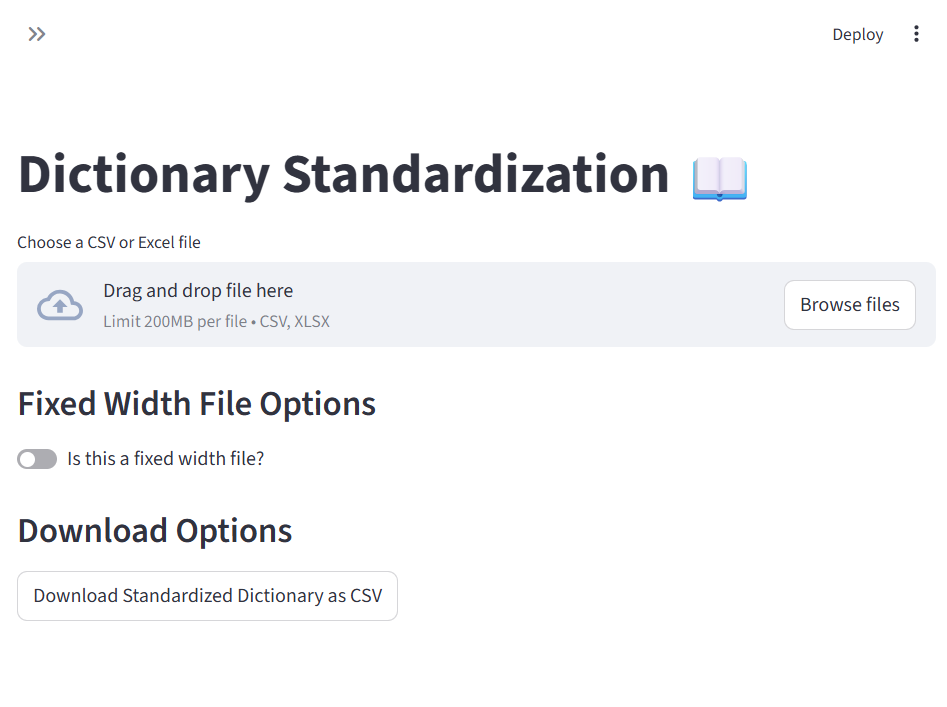
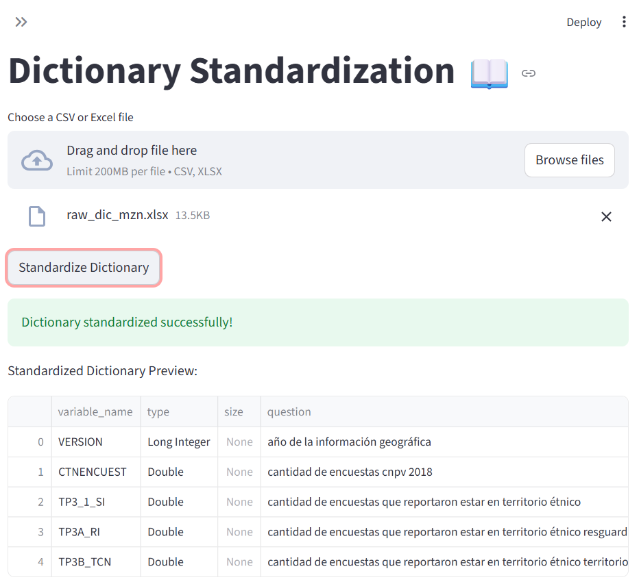
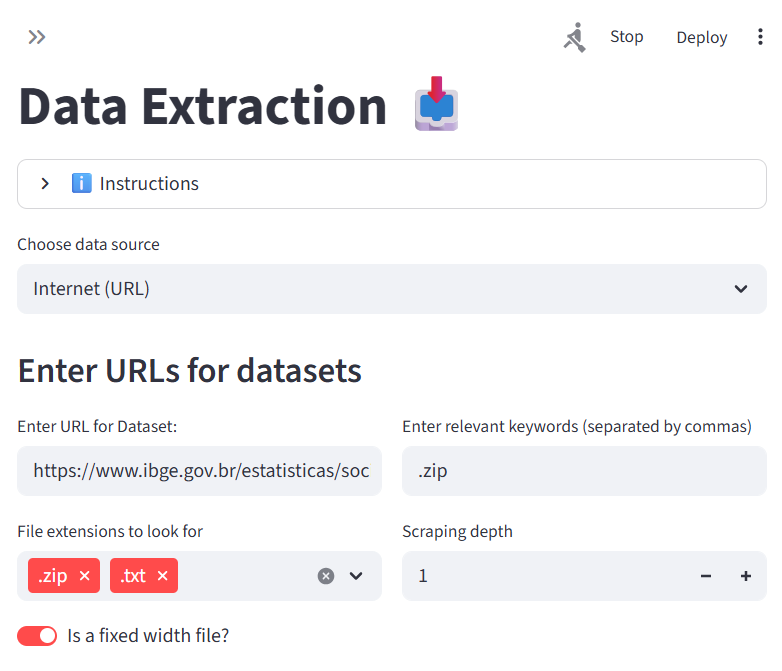
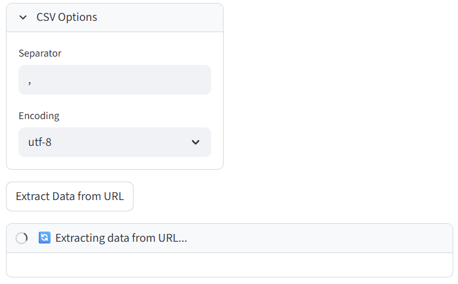

How to use socio4health GUI
=====================================================

For those who prefer a graphical user interface (GUI) over coding, the `Socio4Health GUI <https://github.com/harmonize-tools/interfaz_s4h>`_ provides an easy-to-use platform for data harmonization. This tutorial will guide you through the steps of using a the GUI to **export**, **manage**, and **harmonize** demographic and socioeconomic data.

Installation
-----------------
To use the Socio4Health GUI, you need to fork or clone the `interfaz_s4h repository <https://github.com/harmonize-tools/interfaz_s4h>`_ from GitHub. Once you have the repository on your local machine, navigate to the project directory and install the required dependencies using the following command:

.. code-block:: bash
   pip install -r requirements.txt

After installing the dependencies, you can run the GUI by executing the following command in your terminal:

.. code-block:: bash
   streamlit run Home.py

This will launch the GUI in your default web browser, allowing you to interact with the application.

Using the GUI
-----------------

1. Standardize the raw dictionary
-------------------------------------

In the side menu, click on the **Dictionary Standardization** option. This will take you to a new page where you can upload your raw dictionary file.

Here you can upload your raw dictionary file in ``CSV`` or Excel format. The raw dictionary should contain the following columns: **question**, **variable_name**, **value**, **description**, and **possible_answers**. Before uploading, ensure that your file is properly formatted and contains all the necessary information. Follow the `dictionary creation tutorial <https://harmonize-tools.github.io/socio4health/dictionary.html>`_ to create your raw dictionary.

.. note::
   In case it is a Fixed Width File (``FWF``), you can process it by clicking on the **Is this a fixed width file?** sliding.

Once the file is uploaded, click on the **Standardize Dictionary** button. The GUI will process the file, standardize the dictionary according to the required format and load it into the system for further processing.

If needed, you can download the standardized dictionary by clicking on the **Download Standardized Dictionary** button. This will allow you to save a copy of the standardized dictionary as a ``CSV`` file for your records or for further analysis.

2.  Data Extraction
-------------------------

Choose the data source from the dropdown menu. The available options are: **Internet (URL)**, **Local file**, **Example Brazil Census 2010**, and **Example Colombia Housing Survey 2021**.

If you select **Internet (URL)**, you will need to provide the ``URL`` of the data file you want to upload. Additionally, you can specify any relevant keywords, file extensions to look for, scraping depth and whether the file is a fixed width file (``FWF``).
Also make sure to set ``CSV`` parameters such as the separator and the encoding. Once you have filled in all the required information, click on the **Extract Data from URL (or File)** button to start the data extraction process.

3. Data Harmonization
-------------------------
Once you have extracted the data, you can proceed to harmonize it. Click on the **Harmonization** option in the side menu to access the harmonization page.